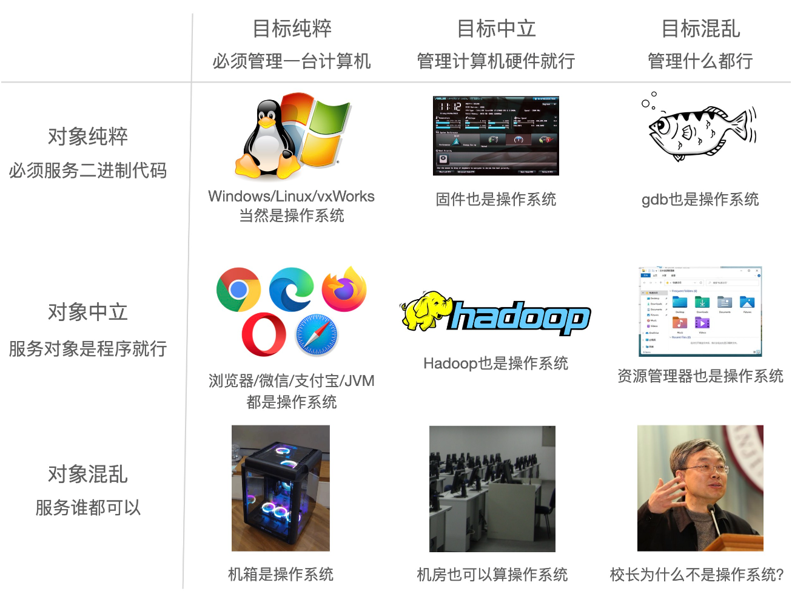

# 操作系统

[toc]

[蒋岩岩老师空间 jyy yyds!](https://space.bilibili.com/202224425)

南京大学 [操作系统：设计与实现](https://space.bilibili.com/202224425/channel/collectiondetail?sid=192498) 听课笔记

## 操作系统概述

### 为什么学操作系统

提到了数学的发展与时代的发展

提到了数学，接着掏出了sympy这个python库来解积分题，太酷炫了，我也要学

我们的“编程力量”尚未完全觉醒：我们还有很多每天都在用的东西还不能自己写出来。为了打通自己的任督二脉，理解各种东西背后的原理并且联系起来。

虽然各种工业级别的软件我们一个人写不出来，但是我们可以摸到一个它的雏形。学习操作系统，变得真正地强。

### 什么是操作系统

programs！

老师说：国内教材都要下严格的定义，但是一个定义要是滴水不漏的话，那这个定义就没有用了。（这个定义就变得味同嚼蜡了）

“管理软硬件资源，为程序提供服务”的程序  。

这个定义给的很哲学，首先有了目的才有了操作系统：操作系统如何从一开始变成现在这样的？

从上世纪的真空管超大计算机开始，出现了延迟线内存，然后用汇编这些。

40年代就没有操作系统。50年代出现更小更快的逻辑门和更大的磁芯内存，出现了卡片打孔的程序（所以那时候必须要画流程图）。

60年代，有了更大的内存，可以把多个程序放到内存里， 然后CPU的速度比打印机快，CPU空闲下来了就可以去跑其他程序。这个时候的操作系统可以控制多个程序交替进行（multiprograming）。有了进程的概念，要隔离进程，多了中断机制，时钟中断和调度策略。

70年代，基本上有了现代操作系统。UNIX诞生走向完善。

今天的操作系统：虚拟化硬件资源，为程序运行提供服务的软件【更复杂的非对称多处理器和内存，更多的设备和资源，复杂的应用需求和应用环境】

三个基本问题：服务谁？为程序提供什么服务？如何实现操作系统提供的服务？

### 怎么学操作系统

1. 是一个合格的操作系统用户：使用Linux，不怕使用任何命令行工具，不怕写代码读代码
   - 学会使用正确的工具
   - 找对正确的材料：用Google/GitHub/StackOverflow
   - 改用命令行就用命令行，该用IDE就用ide
   - sympy，sage，z3，rich这些神奇的python库
2. 学会写代码：**命令行+浏览器=全世界！**
3. 边听课边写代码

