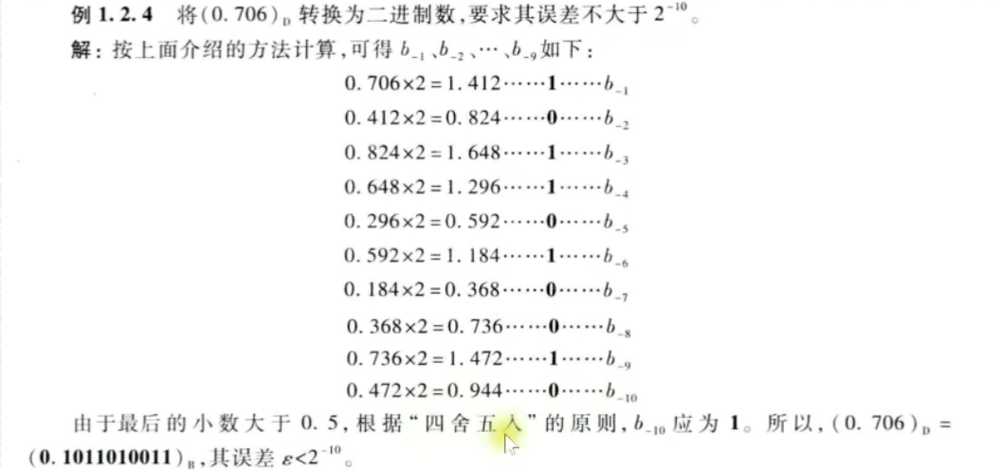
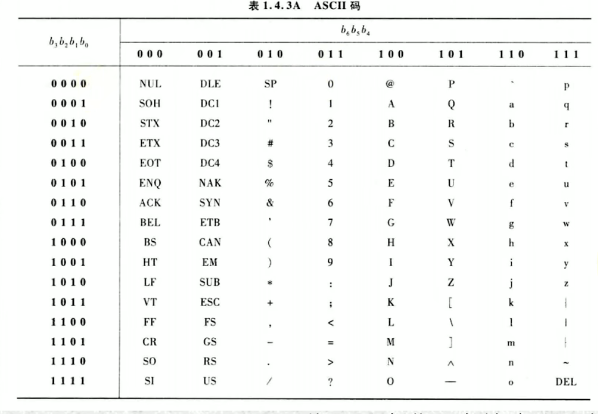
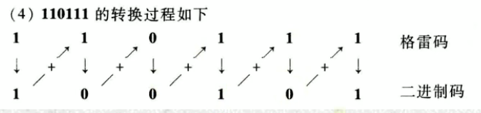
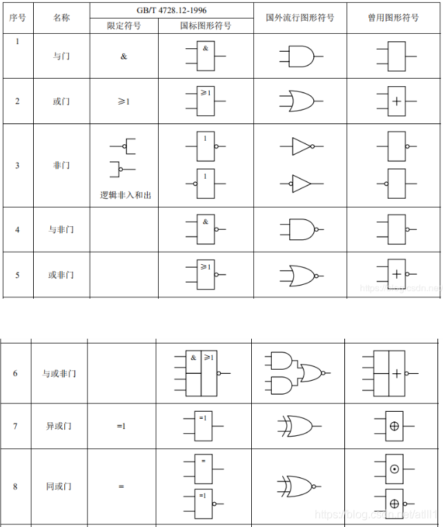

## 数字逻辑电路

进制转换

注意二进制小数转换十进制，小数部分就是2的负几次方。

二进制转十六进制数：二进制凑四位合成一位十六进制，小数部分从左往右凑，整数部分从右往左凑。这个方法相当于直接写。

十进制转二进制：

1. 用短除法，余数逆序。
2. 用拆分法，拆成2的幂。
3. 对于小数部分，采取下面这种做法。
   1. 小数部分单独提出来。
   2. 每次 $\times2$ 然后取走整数部分 0 或 1 ，然后又把小数部分单独提出来。
   3. 把这些整数顺序摆放。

例题：

十进制转十六进制：同理短除法和拆分法，也可以先化二进制然后直接写。

通用转十进制：按权展开相加。

码制转换

8421 BCD 码，就是把十进制每一位都用4位二进制数表示，填入原数中相应的位置。也就是说 0-9 这十个数每个都有自己的 8421 码，对应抄表即可转换。

ASCII 码与 8421 之间的关系：

在高位加上上面表的三位数，就可以从 8421 码转换成 ASCII 码

格雷码：在一组数的编码中，若任意两个相邻的代码只有一位二进制数不同，则称这种编码为**格雷码**

二进制码转换为格雷码：

1. 格雷码最高位（最左边）和二进制码最高位相同，抄下来。
2. 从左往右，逐一将二进制码相邻两位相加（舍去进位），作为格雷码下一位。

$11010\rightarrow 10111$， $101101\rightarrow 111011$

格雷码转换为二进制码：

1. 最高位抄下来
2. 将产生的每一位二进制码，与下一位格雷码相加（舍去进位），作为二进制码的下一位。

例题：

逻辑运算及逻辑门

与非运算：先做与运算，再做非运算。其他的同理。

写多个输入端的真值表：按二进制递增的方法列举情况，然后做与或运算。对于 n 个输入端的逻辑门，一共有 $2^n$ 种不同的输入取值。

背一下各种逻辑门的电路符号

**题型：**画逻辑门输出的波形：确定输入信号的波形然后做运算